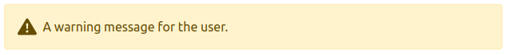

# BootstrapAlert

### Basic Usage

`<BootstrapAlert>Text</BootstrapAlert>` renders a simple bootstrap 5 alert.

```vue
  <template>
    <BootstrapAlert>An informative message for the user.</BootstrapAlert>
  </template>
```

Result:


### Advanced Usage

type - default 'primary', options: 'secondary', 'success', 'danger', 'warning' etc. See bootstrap docs: https://getbootstrap.com/docs/5.0/utilities/colors/

icon - default 'info-fill', options: 'check-circle-fill', 'exclamation-triangle-fill'

```vue
  <template>
    <BootstrapAlert type="warning" icon="exclamation-triangle-fill">A warning message for the user.</BootstrapAlert>
  </template>
```

Result:


