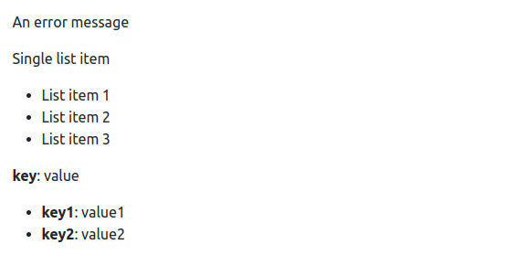
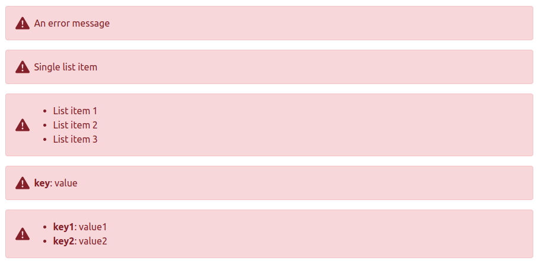

# ErrorRenderer

### Basic Usage

The ErrorRenderer component takes an errors prop that can be an object, array or string and based on it's type
will render appropriate html.

`<ErrorRenderer errors="An error message" />` renders the error as a simple string.

`<ErrorRenderer :errors="['Single list item']" />` renders the error as a simple string.

`<ErrorRenderer :errors="['List item 1', 'List item 2', 'List item 3']" />` renders the error as a html list.

`<ErrorRenderer :errors="{'key': 'value'}" />` renders the error as a simple string.

`<ErrorRenderer :errors="{'key1': 'value1', 'key2': 'value2'}" />` renders the error as a html list.


```vue
  <template>
    <ErrorRenderer errors="An error message" />
    <ErrorRenderer :errors="['Single list item']" />
    <ErrorRenderer :errors="['List item 1', 'List item 2', 'List item 3']" />
    <ErrorRenderer :errors="{'key': 'value'}" />
    <ErrorRenderer :errors="{'key1': 'value1', 'key2': 'value2'}" />
  </template>
```

Result:



Can be combined with the BootstrapAlert component for a nicer look:

```vue
  <template>
    <BootstrapAlert class="d-flex align-items-center" type="danger" icon="exclamation-triangle-fill">
      <ErrorRenderer errors="An error message" />
    </BootstrapAlert>

    <BootstrapAlert class="d-flex align-items-center" type="danger" icon="exclamation-triangle-fill">
      <ErrorRenderer :errors="['Single list item']" />
    </BootstrapAlert>

    <BootstrapAlert class="d-flex align-items-center" type="danger" icon="exclamation-triangle-fill">
      <ErrorRenderer :errors="['List item 1', 'List item 2', 'List item 3']" />
    </BootstrapAlert>

    <BootstrapAlert class="d-flex align-items-center" type="danger" icon="exclamation-triangle-fill">
      <ErrorRenderer :errors="{ 'key': 'value' }" />
    </BootstrapAlert>

    <BootstrapAlert class="d-flex align-items-center" type="danger" icon="exclamation-triangle-fill">
      <ErrorRenderer :errors="{ 'key1': 'value1', 'key2': 'value2' }" />
    </BootstrapAlert>
  </template>
```


