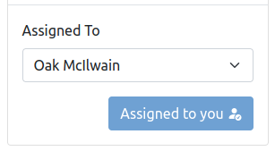

# PanelAssignable

### Usage

Note: This component is normally used in the PanelWorkflow component so doesn't need to be added directly.

```vue
  <template>
    <PanelAssignable
        :content-type="contentType"
        :pk="pk"
        :assignable-users="assignableUsers"
        :assign-to-me-api-url="assignToMeApiUrl"
        :assign-to-api-url="assignToApiUrl"
        :assigned-to="assignedTo"
        :request-user-id="requestUserId"
        @assign-to-me="$emit('assignToMe')"
        @assign-to="assignTo"
    />
  </template>
```

This renders a select drop down with the users from the assignable-users prop as available options.\
It also renders a button that the current user can press to assign the object to themselves.\
If they click the button, then the button text changes to show that they are now the assigned user.

Result:


After clicking the 'Assign to me' button:



