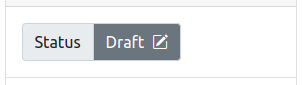
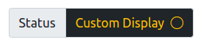

# PanelStatus

This component replaces the PanelStatus.vue component with nicer ui, icon support and the ability to customise the colors and icon for each status value.

### Basic Usage

`<PanelStatus status="draft" />` renders a simple bootstrap 5 status panel.

```vue
  <template>
    <PanelStatus status="draft" />
  </template>
```

Result:



statusDisplay - optional, if passed will use this value to present to the user rather than just the status prop capitalised.

statusColorMap - optional, if passed the component will use this list of objects to know which colours and icons to use when rendering the status panel.

The structure of statusColorMap is:

            {
                custom: {
                    text: 'text-yellow',
                    background: 'bg-secondary',
                    icon: 'bi-pencil-square',
                },
                another_status: {
                    text: 'text-red',
                    background: 'bg-white',
                    icon: 'bi-pencil-circle',
                },                
            },

You can browse the available icons here: https://icons.getbootstrap.com/

```vue
  <template>
    <PanelStatus status="custom" statusDisplay="Custom Display" :statusColorMap="myStatusColorMap" />
  </template>

  <script>
    ...
    export default {
        ...
        data: {
            myStatusColorMap: {
                custom: {
                    text: 'text-warning',
                    background: 'bg-dark',
                    icon: 'bi-circle',
                },             
                otherStatus: {
                    ...etc
                },
                ...
            }
        }
        ...
    }
    ...
    </script>
```

Result:


